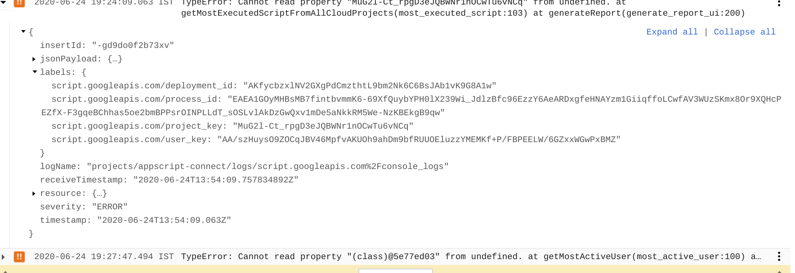
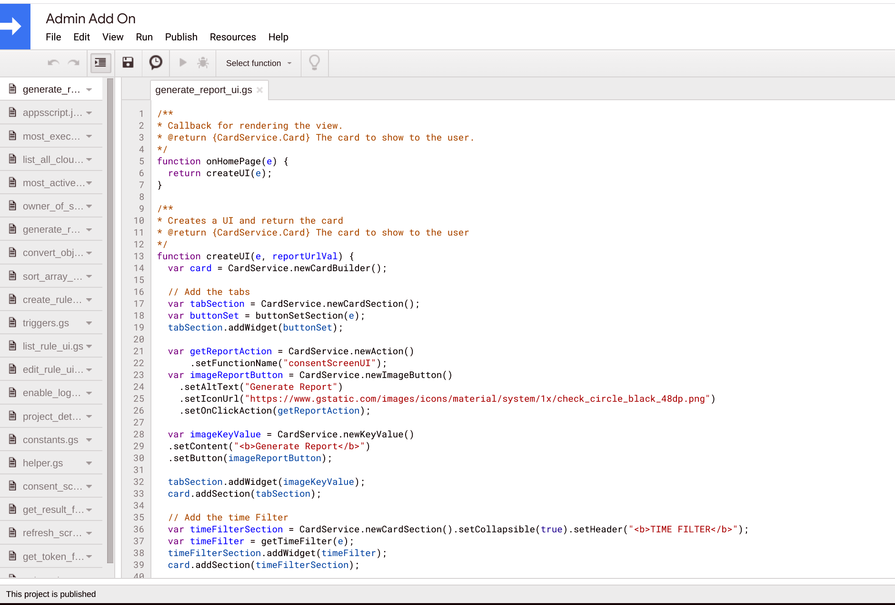
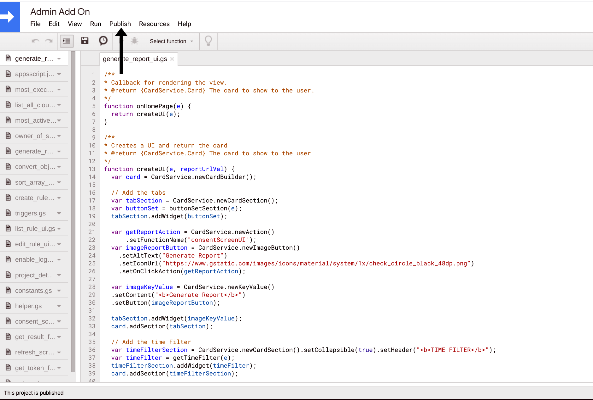
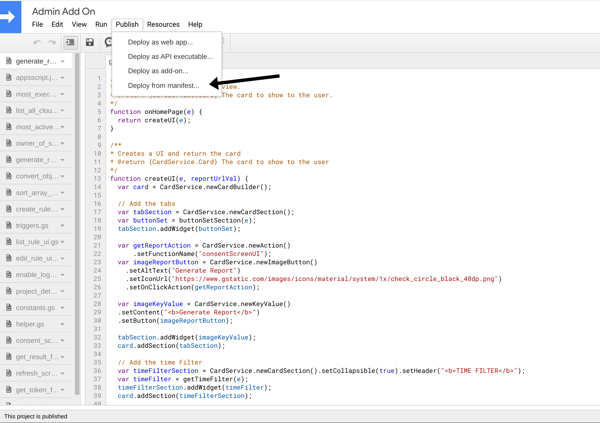
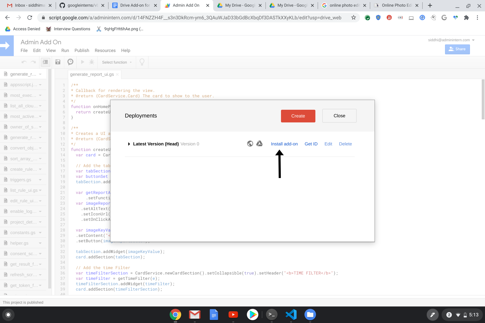
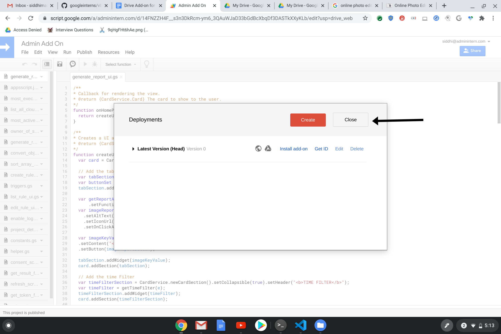
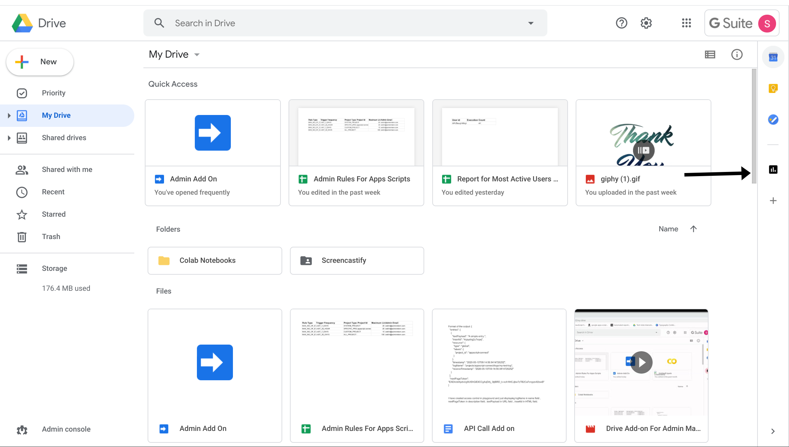

# Admin-Manageability-Addon

## Introduction
Drive add-on which can provide some insights to the admin of Apps Scripts and also allow them to perform some actions.

Insights to be provided are
- Most executed Script
- Most Active Users
- Owner of Apps Script

Actions allowed to admin are
- Create a rule
- Update a rule
- Send notification to both admin and owner if a rule is broken

## Background
- Drive add-on is built using Google apps script
- Cloud Logging APIs are used to analyze the stackdriver logs
- Log entry
 - Label script.googleapis.com/deployment_id is the label which tells us about the deployment id of the Apps script
 - Label script.googleapis.com/process_id tells about the unique process id for the execution. This helps us to determine the number of executions as there can be multiple logEntry for a single execution.
 - Label script.googleapis.com/project_key tells about the unique project Id and this helps to determine which project has more executions and which has less.
 - Label script.googleapis.com/user_key is an encrypted user id which helps to check the users having maximum number of executions.

 


## Requirements
```
1. Having a registered organization with Google
2. Having the IAM Admin role of Resource Manager
```

## Installation

```
Open the link https://script.google.com/d/14FNZZH4F__s3n3DkRcm-ym6_3QAuWJaD33bGdBcXbqDf3DASTkXXyKLb/edit?usp=sharing
```


```
Select Publish
```

 
```
Select Deploy from Manifest
```


```
A dialog box appears
Select install add-on
```


```
Click Close Button
```


```
Open the drive and click the chart icon
```


## Built With

- [Apps Script](https://developers.google.com/apps-script) Used for creating the whole back end
- [Card Service](https://developers.google.com/apps-script/reference/card-service) Used to build the UI for the add-on
- [Python](https://www.python.org/) Used to build the script files
- [Flask](https://flask.palletsprojects.com/en/1.1.x/) Used to create the API

## Other Refrences 

- [Add-ons](https://developers.google.com/gsuite/add-ons/overview) Overview of an add-on with sample add-on
- [Cloud Logging APIs](https://cloud.google.com/logging/docs)Overview of logging APIs with functionality and usage
- [Log Entry](https://cloud.google.com/logging/docs/reference/v2/rest/v2/LogEntry) Structure of the stackdriver logs with functionality
